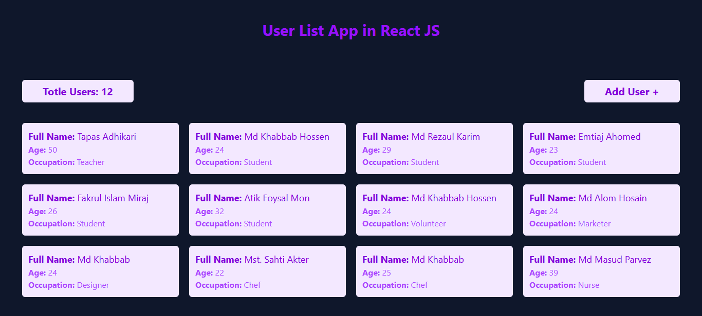
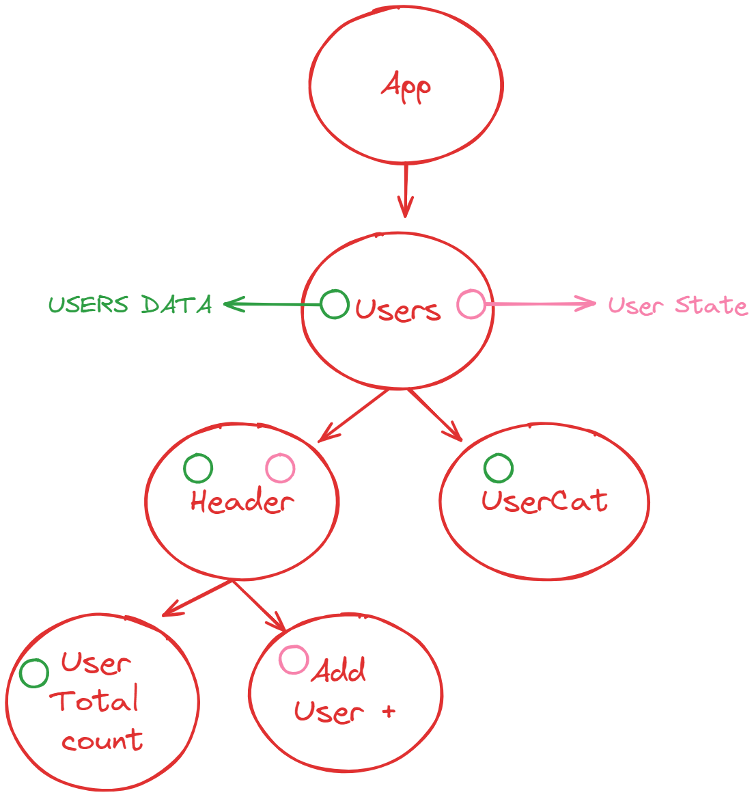

# 🕵️ Users App

### ☘️ Explain

User List is a fast and interactive React app built with Vite. Users can be added to it and the total number of users can be counted. This app is great for understanding React basics and utilizing Vite for a fast development experience.

---

### 📋 Features

- **User List Display:** Shows a dynamic list of User with their details.
- **Counter Bar:** Count how many users are on your list by soot.
- **Add User:** You can add new users by clicking this button.
- **Fast Build & Hot Reload:** Powered by Vite for lightning-fast development.

---

### 🚀 How to Run the Project

1.  Clone the Repository: `git clone https://github.com/khabbab50/TapaScriptAddUserApp.git` `cd userApp`

2.  Install Dependencies
    Ensure you have Node.js installed. Then run:
    `npm install`

3.  For Tailwindcss `npm install -D tailwindcss` `npx tailwindcss init`

4.  Start the Development Server `npm run dev`

5.  Visit the App:
    Open your browser and navigate to the URL provided by Vite (e.g., http://localhost:5173).

---

### 🌐 Live Demo

Check out the deployed app here: [Click here](https://tapa-script-add-user-app.vercel.app/)

---

# 📷 Screenshots

### Component Breakdown diagram

---

### Component Hierarchy diagram

---

# 🛠️ Tools & Technologies

- React.js
- Vite (for fast builds and development)
- CSS/Tailwind
- Node.js (for local development)
- React Dev Tools
